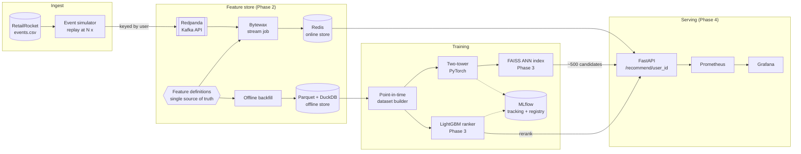

# Streamline

A production-style real-time recommendation system with a streaming feature store,
built on the [RetailRocket](https://www.kaggle.com/datasets/retailrocket/ecommerce-dataset)
e-commerce clickstream (2.76M events, 1.4M visitors, 235K items).

The focus is on what makes recommenders hard in production: **point-in-time
correctness**, **no training/serving skew**, **time-based evaluation**, and
**measured latency**. Only a few features are built, and each one is tested.

## Architecture



**Status:** Phase 1 is complete: ingest, simulator, time-based evaluation, baselines,
the two-tower model and MLflow tracking. Components marked Phase 2–5 are planned (see [Roadmap](#roadmap)).

## Results

Test window: the last 14 days (2015-09-04 02:59 UTC onward). Validation: the 14 days before that
(from 2015-08-21 02:59 UTC). Metrics are averaged over the **14,774 warm test users**
(127,251 cold users with no prior events are not scored; see Design decisions).
New-item columns score the 12,486 users who touched at least one item they had never seen before.
The two-tower row is mean ± std over 3 seeds. The popularity window (14 days) was chosen on validation.

| Model | Recall@50 | NDCG@10 | MRR@50 | New-item Recall@50 | New-item NDCG@10 | Val Recall@50 |
|---|---|---|---|---|---|---|
| Popularity | 0.0193 | 0.0051 | 0.0055 | 0.0153 | 0.0038 | 0.0211 |
| Recently viewed + popularity | 0.1880 | 0.1682 | 0.1824 | 0.0153 | 0.0038 | 0.2074 |
| Two-tower (3 seeds) | 0.2220 ± 0.0004 | 0.1687 ± 0.0008 | 0.1796 ± 0.0007 | 0.0745 ± 0.0011 | 0.0254 ± 0.0007 | 0.2385 ± 0.0013 |

Source: [`reports/results.md`](reports/results.md) and [`reports/results.json`](reports/results.json),
generated by `make train` at commit `7f9a937`. All runs, including per-epoch validation curves, are in MLflow.

**Reading the table**
- The two-tower model improves Recall@50 by **18% relative** over the strongest baseline
  (0.222 vs 0.188), and is **11.5× better** than global popularity.
- On **new items** it gets about **4.9× the recall** of either baseline (0.075 vs 0.015). That's the
  retrieval capability the later ranking stage depends on. For new items, *Recently viewed* is
  identical to popularity, since removing seen items leaves only its popularity backfill.
- At the very top of the list it only ties: NDCG@10 is 0.169 vs 0.168, and MRR is slightly
  *lower* (0.180 vs 0.182). Recency of the user's own items is hard to beat at rank 1. The Phase 3 LightGBM ranker is designed
  to close this gap by combining retrieval scores with recency features.
- Metrics are exact brute-force retrieval over the full 153K-item vocabulary; the numbers
  after the Phase 3 FAISS index will be reported separately.

## Quickstart

Prerequisites: Docker, [uv](https://docs.astral.sh/uv/), and a Kaggle API token.

```bash
make install   # uv sync + pre-commit hooks
make up        # Redpanda, Redpanda Console, Redis, Postgres, MLflow
make data      # download events.csv from Kaggle -> data/raw, build parquet
make eda       # dataset summary -> reports/eda.md
make train     # baselines + two-tower (3 seeds), logged to MLflow -> reports/results.md
make simulate  # replay events into Redpanda (SPEEDUP=1000 START_DATE=2015-09-04)
make check     # ruff + mypy + pytest (what CI runs)
```

| Service | URL |
|---|---|
| MLflow | http://localhost:5001 |
| Redpanda Console | http://localhost:8080 |
| Kafka API | localhost:19092 |
| Redis | localhost:6380 |

**Kaggle credentials.** Create a token at kaggle.com → Settings → API → *Create New Token*.
Then either save the token string to `~/.kaggle/access_token` (or `export KAGGLE_API_TOKEN=...`),
or save the downloaded `kaggle.json` to `~/.kaggle/kaggle.json`. `make data` prints
these instructions if no credentials are found.

`make serve` and `make loadtest` are reserved for Phase 4.

## Design decisions

- **Time-based split, not random.** The last 14 days are the test set, the 14 days before them are
  validation, and everything earlier is training. A random split would leak the future into
  training and inflate every metric.
- **Fit on the past, predict the next window.** For validation, models are fit on train and
  predict the validation window. For the test, models are refit on train + val with the settings
  selected on validation, then predict the test window. The test set is only used once, for the
  final numbers.
- **Warm users only.** 90% of visitors in a 14-day window have no earlier events. Without
  history every model falls back to popularity, so the headline metrics cover users with at
  least one prior event, and the cold-user count is reported next to them.
- **New-item metrics.** About 14% of target interactions are items the user already touched.
  Recommending the user's own history is therefore strong, and it's included as an explicit
  baseline. The `New-item` columns remove seen items from both the recommendations and the
  relevant set, to measure discovery separately.
- **Point-in-time correct training.** Each two-tower training example is (the user's events
  *strictly before* event *t*, the item at *t*). `tests/test_two_tower.py` checks that no
  example's history includes the target event, a later event, or another user's events.
- **Two-tower model.** The user tower mean-pools the last 50 events (item + event type +
  recency position) and concatenates the most recent event, followed by an MLP. The item tower
  is an item embedding shared with the user tower plus a residual MLP. Training uses in-batch
  sampled softmax with **logQ correction** (so the model doesn't just learn popularity) and
  masks duplicate items within a batch. Model selection uses early stopping on validation
  Recall@50. Scoring is currently exact dot product; FAISS replaces it in Phase 3.
- **The history-based user tower** (rather than a per-user ID embedding) works for any user
  with recent events, including ones unseen at training time. It's also the shape the online
  feature store will serve.

## Repo layout

```
infra/                 docker-compose.yml, MLflow image
src/streamline/
  config.py            settings (env-overridable)
  ingest/              download, typed loader, EDA, Redpanda simulator
  features/            (Phase 2) shared feature definitions, stream job, backfill
  training/            time split, baselines, two-tower model, training pipeline
  serving/             (Phase 4) FastAPI app
  eval/                Recall@K / NDCG@K / MRR, offline evaluation harness
tests/                 unit tests (+ `-m integration` against the live stack)
notebooks/             EDA charts only
reports/               generated EDA + results (committed, real numbers only)
```

## Roadmap

- **Phase 2: streaming features.** A Bytewax job consumes `clickstream` and maintains
  session features and rolling 5-min / 1-hr counts per user and item in Redis. The same
  feature definitions drive an offline backfill to Parquet/DuckDB. A skew test asserts that
  online and offline values are identical for the same entity and timestamp.
- **Phase 3: retrieval + ranking.** A FAISS index over item-tower embeddings retrieves
  ~500 candidates. A LightGBM LambdaRank reranker is trained on point-in-time features from
  the offline store, with a leakage test on the training set builder.
- **Phase 4: serving.** FastAPI `/recommend/{user_id}` fetches features from Redis, queries
  FAISS, reranks with LightGBM and returns the top-K. `/health` and `/metrics` are exposed.
  A Locust load test and Prometheus/Grafana dashboards target p99 < 50 ms.
- **Phase 5: MLOps.** MLflow model registry, shadow deployment, an A/B router with
  significance testing, and feature/prediction drift monitoring.
